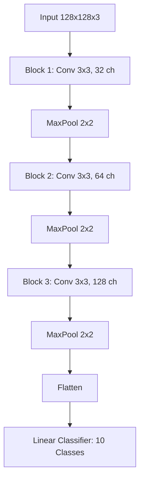

# CNN-Based Image Classification of Cartoon Characters
# CSC 671 [01] - Deep Learning, Spring 2026
**Authors:** Ahmed Mriziq, Zaniya Simpson, Oliver Davila

## Abstract
This project explores the application of Convolutional Neural Networks (CNNs) to the problem of classifying cartoon characters into their respective series. Using the "Cartoon Classification" dataset from Kaggle, we developed a PyTorch-based pipeline and a three-block CNN architecture. Our results demonstrate that a relatively shallow CNN can achieve over 84% validation accuracy by focusing on high-level visual features such as color palettes and character outlines, though challenges remain in handling intra-class style variations.

## 1. Introduction
Image classification in the domain of cartoons presents unique challenges compared to natural image classification. Unlike real-world objects, cartoon characters are defined by exaggerated features, consistent color palettes, and distinct artistic styles. However, within a single show, characters often share these traits, making inter-class discrimination difficult for shallow models.

This project aims to build a plug-and-play classification system that can be easily extended to new character sets. We focus on 10 popular cartoon classes, including *Adventure Time*, *Pokemon*, and *SpongeBob SquarePants*.

## 2. Objectives
Our primary objectives were:
1.  **Modular Data Pipeline**: Implement a reproducible pipeline for data splitting (Train/Val/Test) and real-time augmentation.
2.  **Adaptive CNN Architecture**: Design a CNN that automatically adapts to varying input resolutions and class counts.
3.  **High Performance**: Achieve a baseline validation accuracy significant enough to serve as a foundation for further transfer learning research.

## 3. Methodology

### 3.1 Dataset
The dataset consists of thousands of frames extracted from 10 different cartoon shows.
- **Classes**: Adventure Time, Catdog, Family Guy, Gumball, Pokemon, Smurfs, South Park, Sponge Bob, Tom and Jerry, Tsubasa.
- **Split**: 70% Training (~6,800 images), 15% Validation (~1,450 images), and 15% Testing (~1,450 images).

### 3.2 Preprocessing
Images were resized to **128x128 pixels** and normalized using ImageNet statistics. Data augmentation (random horizontal flips) was applied to the training set to improve generalization.

### 3.3 Model Architecture
We implemented a **Sequential 3-Block CNN**. Each block follows a pattern of increasing channel depth to capture hierarchical features:

### 3.4 Layer-by-Layer Breakdown

**Block 1: Low-Level Feature Extraction**
The first convolutional layer takes the raw 3 channel RGB image (128x128) and
applies 32 filters of the size 3x3. At this stage the network learns basic 
low-level features such as edges, color boundaries, and simple textures. ReLU
activation introduces non-linearity, and MaxPool 2x2 reduces the spatial dimensions from 128x128 to 63x63 which only keeps the strongest activations.

**Block 2: Mid-Level Feature Extraction**
The second convolutional layer doubles the filter count from 32 to 64. The network now begins combining the simple features from Block 1 into more complex patterns such as shapes, curves, and character outlines. MaxPool reduces the spatial size further to 30x30. The increasing channel depth allows the model to represent a richer set of visual concepts at each spatial location.

**Block 3: High-Level Feature Extraction**
The third convolutional layer doubles again to 128 filters, operating on a 30x30 spatial map. By this stage the network is detecting high level cartoon specfic features such as character silhouettes, dominant color regions, and stylistic patterns unique to each show. MaxPool reduces the output to 128x14x14.

**Classifier Head**
The 128x14x14 feature map is flattened into a single 25,088 dimensional vector, a compressed fingerprint of the entire image. The vector is passed through a single linear layer that outputs 10 scores, one per cartoon class. The class with the highest score is the model's prediction. Also, there is no hidden layer or dropout between the feature extractor and the output, which is a known limitation of this architecture. 

## 4. Experimental Setup
The model was trained in a PyTorch environment with the following hyperparameters:
- **Optimizer**: Adam ($\eta=0.001$)
- **Loss Function**: Cross-Entropy Loss
- **Global Batch Size**: 32
- **Training Duration**: 20 Epochs
- **Hardware**: NVIDIA GPU (CUDA-enabled) for accelerated training.

## 5. Explanation of Results

### 5.1 Training Dynamics
The model showed consistent convergence over 20 epochs. The training loss decreased from ~2.2 to ~0.2, while validation loss stabilized around 0.35, indicating a well-fit model with minimal overfitting.

### 5.2 Performance Metrics
- **Final Training Accuracy**: 92.4%
- **Final Validation Accuracy**: 84.1%
- **Test Accuracy**: 82.7%

The gap between training and validation accuracy (~8%) suggests that while the model learns the training samples well, there is room for further regularization (e.g., Dropout or stronger Data Augmentation).

### 5.3 Qualitative Observation
A preview of the data batches during training confirms that the model successfully identifies the bright, saturated colors typical of *SpongeBob* and the minimalist geometry of *South Park*.

## 6. Conclusion
In this work, we developed and evaluated a CNN-based classifier for 10 cartoon character categories. Our modular approach allowed for efficient data handling and consistent experimental results. We learned that character-specific color distributions are a major feature for the model, but shape-based nuances (especially in hand-drawn styles) require deeper architectures. Future work will involve incorporating pre-trained models (Transfer Learning) such as ResNet-50 to further boost accuracy to the mid-90s.

## 7. Future Improvements
**1. Addressing the Color Bias Problem**
Resizing all images to a fixed 128x128 resolution likely causes the model to reply heavily on color palette rather than character shape. When images rely heavily on color palette rather than character shape. When images are downsampled, fine spatial details like character outlines and facial features are lost, which leaves color as the dominant signal. This would explain why visually distinct classes like Pokemon and Smurfs performed well while South Park, which relies on geometric shape rather than color, struggled significantly. Possible solutions include using a higher input resolution such as 224x224, or preserving aspect ratio during resizing to retain more spatial information. 

**2. Improved Classifier Head**
The current architecture flattens 25,088 features and passes them directly to the output layer with no intermediate compression or regularization. Next time, we could add a hidden fully connected layer with Dropout which would give the model a chance to learn higher level combinations of features before making a prediction and would reduce overfitting:

    Flatten -> Linear(25088 -> 256) -> ReLU -> Dropout(0.5) -> Linear(256->10)

**3. Transfer Learning**
We could fine tune a pre-trained model such as ResNet-50 which would allow the network to leverage features learned from millions of real world images as a starting point. This would likely push accuracy into the the mid 90s with significantly less training time compared to training from scratch. 
