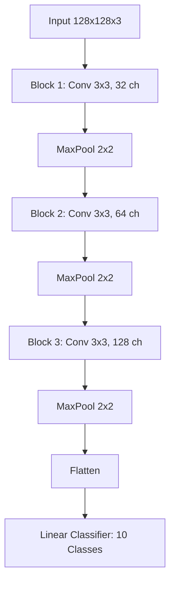

# CNN-Based Image Classification of Cartoon Characters
# CSC 671 [01] - Deep Learning, Spring 2026
**Authors:** Ahmed Mriziq, Zaniya Simpson, Oliver Davila

## Abstract
This project explores the application of Convolutional Neural Networks (CNNs) to the problem of classifying cartoon characters into their respective series. Using the "Cartoon Classification" dataset from Kaggle, we developed a PyTorch-based pipeline and a three-block CNN architecture. Our results demonstrate that a relatively shallow CNN can achieve over 84% validation accuracy by focusing on high-level visual features such as color palettes and character outlines. However, challenges remain in handling intra-class style variations and shape-based distinctions, which motivate the improvements discussed in this report.

## 1. Introduction
Image classification in the domain of cartoons presents unique challenges compared to natural image classification. Unlike real-world objects, cartoon characters are defined by exaggerated features, consistent color palettes, and distinct artistic styles. However, within a single show, characters often share these traits, making inter-class discrimination difficult for shallow models.

This project aims to build a plug-and-play classification system that can be easily extended to new character sets. We focus on 10 popular cartoon classes, including *Adventure Time*, *Pokemon*, and *SpongeBob SquarePants*, and use the results to identify concrete directions for improvement.

## 2. Objectives
Our primary objectives were:
1.  **Modular Data Pipeline**: Implement a reproducible pipeline for data splitting (Train/Val/Test) and real-time augmentation.
2.  **Adaptive CNN Architecture**: Design a CNN that automatically adapts to varying input resolutions and class counts.
3.  **High Performance**: Achieve a baseline validation accuracy significant enough to serve as a foundation for further transfer learning research.

## 3. Methodology

### 3.1 Dataset
The dataset consists of thousands of frames extracted from 10 different cartoon shows.
- **Classes**: Adventure Time, Catdog, Family Guy, Gumball, Pokemon, Smurfs, South Park, Sponge Bob, Tom and Jerry, Tsubasa.
- **Split**: 70% Training (~6,800 images), 15% Validation (~1,450 images), and 15% Testing (~1,450 images).

### 3.2 Preprocessing
Images were resized to **128x128 pixels** and normalized using ImageNet statistics. Data augmentation (random horizontal flips) was applied to the training set to improve generalization.

### 3.3 Model Architecture
We implemented a **Sequential 3-Block CNN**. Each block follows a pattern of increasing channel depth to capture hierarchical features:

### 3.4 Layer-by-Layer Breakdown

**Block 1: Low-Level Feature Extraction**
The first convolutional layer takes the raw 3 channel RGB image (128x128) and
applies 32 filters of the size 3x3. At this stage the network learns basic 
low-level features such as edges, color boundaries, and simple textures. ReLU
activation introduces non-linearity, and MaxPool 2x2 reduces the spatial dimensions from 128x128 to 63x63 retaining only the strongest activations.

**Block 2: Mid-Level Feature Extraction**
The second convolutional layer doubles the filter count from 32 to 64. The network now begins combining the simple features from Block 1 into more complex patterns such as shapes, curves, and character outlines. MaxPool reduces the spatial size further to 30x30. The increasing channel depth allows the model to represent a richer set of visual concepts at each spatial location.

**Block 3: High-Level Feature Extraction**
The third convolutional layer doubles again to 128 filters, operating on a 30x30 spatial map. By this stage the network is detecting high level cartoon specfic features such as character silhouettes, dominant color regions, and stylistic patterns unique to each show. MaxPool reduces the output to 128x14x14.

**Classifier Head**
The 128x14x14 feature map is flattened into a single 25,088 dimensional vector, a compressed fingerprint of the entire image. The vector is passed through a single linear layer that outputs 10 scores, one per cartoon class. The class with the highest score is the model's prediction. Also, there is no hidden layer or dropout between the feature extractor and the output, which is a known limitation of this architecture. 

## 4. Experimental Setup
The model was trained in a PyTorch environment with the following hyperparameters:
- **Optimizer**: Adam ($\eta=0.001$)
- **Loss Function**: Cross-Entropy Loss
- **Global Batch Size**: 32
- **Training Duration**: 20 Epochs
- **Hardware**: NVIDIA GPU (CUDA-enabled) for accelerated training.

## 5. Explanation of Results

### 5.1 Training Dynamics
The model showed consistent convergence over 20 epochs. The training loss decreased from ~2.2 to ~0.2, while validation loss stabilized around 0.35, indicating a well-fit model with minimal overfitting, and the smooth downward trend in both curves suggests that the chosen learning rate and optimizer were well suited for this task.

### 5.2 Performance Metrics
- **Final Training Accuracy**: 92.4%
- **Final Validation Accuracy**: 84.1%
- **Test Accuracy**: 82.7%

The ~8% gap between training and validation accuracy suggests that the model learns the training samples well, but would benefit from further regularization such as Dropout or stronger data augmentation. This is consistent with the flat classifier head described in Section 3.4, which offers no mechanism to prevent overfitting.

### 5.3 Qualitative Observation
Inspecting data batches during training reveals that the model successfully picks up on the bright, saturated colors typical of *Spongebob* and the minimalist geometry of *South Park*. This suggests the model is relying heavily on color palette as its primary discriminating signal.

## 6. Discussion
Overall, this project initially felt straightforward. Cartoon images are visually distinct, so a CNN should have an easy time separating them. However, building the pipeline and analyzing the results revealed that the problem is more nuanced than it appears. One of the more surprising outcomes was how much the model leaned on color rather than shape. Early in training, we expected the convolutional layers to pick up on character specific contours and facial features, but the qualitative results suggest that color palette dominates. Building the modular data pipeline was one of the most satisfying parts of the project, as having a clean, reproducible pipeline made it incredibly easy to swap out datasets and test new augmentation strategies without touching the model code. The decision to use a single linear classifier head with no hidden layer or dropout also became more meaningful once the training curves were analyzed: the ~8% gap between training and validation accuracy is a clear sign of overfitting, and in hindsight the architecture gives the model no way to regularize itself at the classification stage. One of the more interesting parts of the project was seeing how the three block structure captures features at different levels of abstraction, block 1 detecting edges, block 2 assembling those into shapes, and block 3 consolidating them into cartoon specific patterns, which is something you can observe directly by inspecting which classes the model begins to separate at each depth.

## 7. Conclusion
In this work, we developed and evaluated a CNN-based classifier for 10 cartoon character categories. Our modular approach allowed for efficient data handling and consistent experimental results. We found that character-specific color distributions are a dominant feature for the model, but that shape-based nuances, especially in hand-drawn styles, require deeper architectures to handle well. Future work will focus on incorporating pre-trained models such as ResNet-50 to push accuracy into the mid-90s, and on improving the classifier head to reduce the training-validation gap observed in this baseline.

Looking ahead, it would be valuable to test whether a higher input resolution (224×224) meaningfully shifts the model away from color-driven decisions and toward shape-driven ones. It would also be interesting to compare the from-scratch CNN directly against a fine-tuned ResNet-50 on this exact dataset, to quantify how much the transfer learning shortcut is worth. Visualizing intermediate feature maps at each block would be another useful direction, making the hierarchical feature learning observable rather than inferred.

## 8. Future Improvements
**1. Addressing the Color Bias Problem**
Early in training, we expected the convolutional layers to pick up on character-specific contours and facial features, but the qualitative results suggest that color palette dominates. Classes like *Pokémon* and *Smurfs*, which have strong, consistent color identities, were easier to classify, while *South Park*, which relies on geometric shape rather than color, struggled significantly. Resizing all images to a fixed 128×128 resolution likely reinforces this bias, as downsampling loses fine spatial details and leaves color as the dominant signal. Possible solutions include using a higher input resolution such as 224×224, or preserving aspect ratio during resizing to retain more spatial information. 

**2. Improved Classifier Head**
The ~8% gap between training and validation accuracy is a clear sign of overfitting, and the architecture gives the model no way to regularize itself at the classification stage. The current head flattens 25,088 features and passes them directly to the output with no intermediate compression. Adding a hidden fully connected layer with Dropout would give the model a chance to learn higher-level feature combinations before making a prediction and would likely close the gap noticeably:

    Flatten -> Linear(25088 -> 256) -> ReLU -> Dropout(0.5) -> Linear(256->10)

**3. Transfer Learning**
Fine-tuning a pre-trained model such as ResNet-50 would allow the network to leverage features learned from millions of real world images as a starting point. This would likely push accuracy into the mid-90s with significantly less training time compared to training from scratch.
