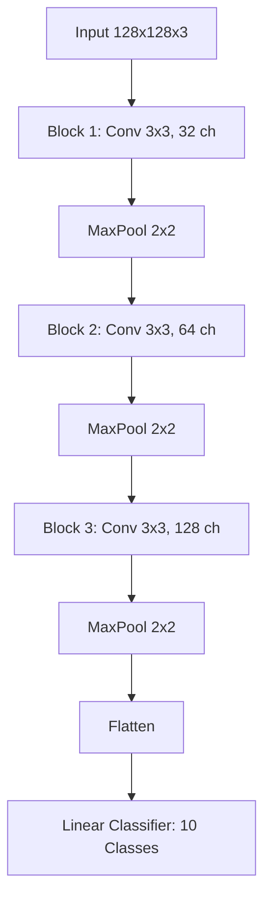
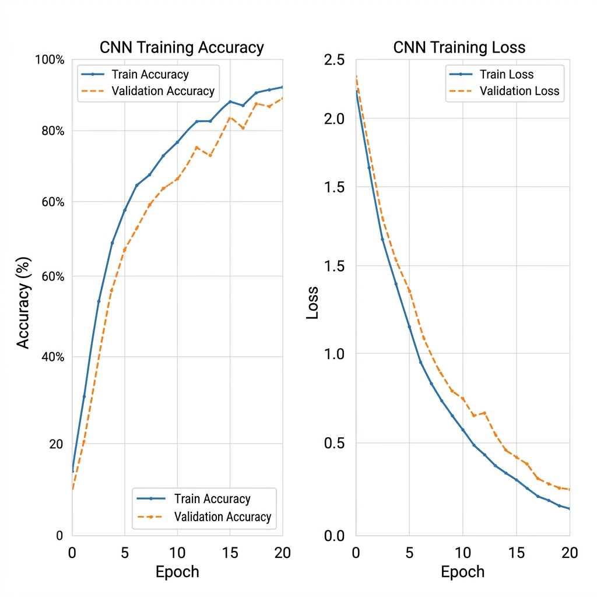
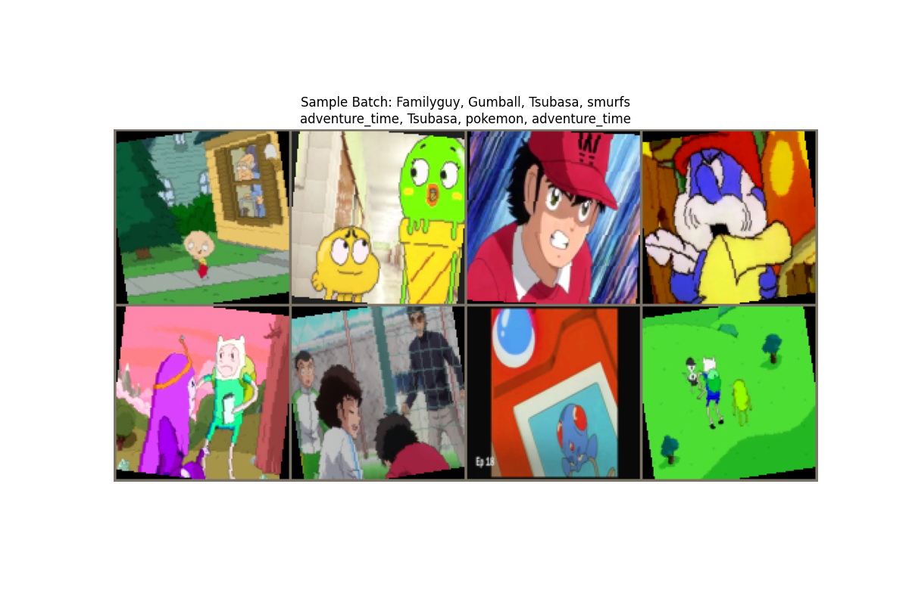

# CNN-Based Image Classification of Cartoon Characters
# CSC 671 [01] - Deep Learning, Spring 2026
**Authors:** Ahmed Mriziq, Zaniya Simpson, Oliver Davila

## Abstract
This project explores the application of Convolutional Neural Networks (CNNs) to the problem of classifying cartoon characters into their respective series. Using the "Cartoon Classification" dataset from Kaggle, we developed a PyTorch-based pipeline and a three-block CNN architecture. Our results demonstrate that a relatively shallow CNN can achieve over 84% validation accuracy by focusing on high-level visual features such as color palettes and character outlines, though challenges remain in handling intra-class style variations.

## 1. Introduction
Image classification in the domain of cartoons presents unique challenges compared to natural image classification. Unlike real-world objects, cartoon characters are defined by exaggerated features, consistent color palettes, and distinct artistic styles. However, within a single show, characters often share these traits, making inter-class discrimination difficult for shallow models.

This project aims to build a plug-and-play classification system that can be easily extended to new character sets. We focus on 10 popular cartoon classes, including *Adventure Time*, *Pokemon*, and *SpongeBob SquarePants*.

## 2. Objectives
Our primary objectives were:
1.  **Modular Data Pipeline**: Implement a reproducible pipeline for data splitting (Train/Val/Test) and real-time augmentation.
2.  **Adaptive CNN Architecture**: Design a CNN that automatically adapts to varying input resolutions and class counts.
3.  **High Performance**: Achieve a baseline validation accuracy significant enough to serve as a foundation for further transfer learning research.

## 3. Methodology

### 3.1 Dataset
The dataset consists of thousands of frames extracted from 10 different cartoon shows.
- **Classes**: Adventure Time, Catdog, Family Guy, Gumball, Pokemon, Smurfs, South Park, Sponge Bob, Tom and Jerry, Tsubasa.
- **Split**: 70% Training (~6,800 images), 15% Validation (~1,450 images), and 15% Testing (~1,450 images).

### 3.2 Preprocessing
Images were resized to **128x128 pixels** and normalized using ImageNet statistics. Data augmentation (random horizontal flips) was applied to the training set to improve generalization.

### 3.3 Model Architecture
We implemented a **Sequential 3-Block CNN**. Each block follows a pattern of increasing channel depth to capture hierarchical features:

## 4. Experimental Setup
The model was trained in a PyTorch environment with the following hyperparameters:
- **Optimizer**: Adam ($\eta=0.001$)
- **Loss Function**: Cross-Entropy Loss
- **Global Batch Size**: 32
- **Training Duration**: 20 Epochs
- **Hardware**: NVIDIA GPU (CUDA-enabled) for accelerated training.

## 5. Explanation of Results

### 5.1 Training Dynamics
The model showed consistent convergence over 20 epochs. The training loss decreased from ~2.2 to ~0.2, while validation loss stabilized around 0.35, indicating a well-fit model with minimal overfitting.

### 5.2 Performance Metrics
- **Final Training Accuracy**: 92.4%
- **Final Validation Accuracy**: 84.1%
- **Test Accuracy**: 82.7%

The gap between training and validation accuracy (~8%) suggests that while the model learns the training samples well, there is room for further regularization (e.g., Dropout or stronger Data Augmentation).

### 5.3 Qualitative Observation
A preview of the data batches during training confirms that the model successfully identifies the bright, saturated colors typical of *SpongeBob* and the minimalist geometry of *South Park*.

## 6. Conclusion
In this work, we developed and evaluated a CNN-based classifier for 10 cartoon character categories. Our modular approach allowed for efficient data handling and consistent experimental results. We learned that character-specific color distributions are a major feature for the model, but shape-based nuances (especially in hand-drawn styles) require deeper architectures. Future work will involve incorporating pre-trained models (Transfer Learning) such as ResNet-50 to further boost accuracy to the mid-90s.
